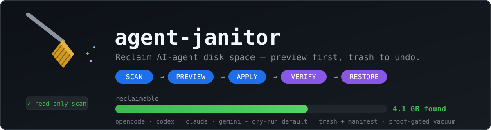

# agent-janitor



Reclaim disk space from AI coding agent harnesses — with a preview first, a trash to undo, and proof before any database surgery.

AI coding agents hoard storage: OpenCode's SQLite DB grows to 72 GB in two weeks ([#47022]); Codex writes per-turn project-tree checkpoints into your repos' `.git` and never garbage-collects them (100+ GB cases, [#29388]); Claude Code transcripts pile up; base64 blobs sit inside session DBs ([openclaw#143973]). No harness ships retention or vacuum tooling. agent-janitor audits all of them and reclaims the space — and refuses unsafe operations instead of guessing.

Example output — numbers vary by machine:

```
$ npx agent-janitor scan
agent-janitor v0.2.0

Scanning AI coding-agent storage... (retention 30d)

✓ opencode
✓ codex
✓ claude
✓ cursor

Reclaimable storage

opencode
Logs                          184 MB  (3 items)
DB compaction                 412 MB  (12,408 superseded + 3 dupe rows)
claude
Stale sessions                 96 MB  (21 items)
cursor
Stale workspaces               240 MB  (6 items)

------------------------------------
Potential reclaimable space    932 MB
------------------------------------

Nothing was changed. scan is always read-only.

Next:
  agent-janitor clean    # preview what would move to trash (dry run)
```

## Why this exists

Session transcripts, rollout logs, snapshot dirs, and event-sourced DB rows accumulate silently across every AI harness. Each one is small; together they eat gigabytes. agent-janitor tells you exactly what is wasting space, lets you preview the cleanup, refuses unsafe operations, keeps recoverable files in trash, proves database changes before making them, and shows exactly what happened.

## Safety model

- `scan` is always read-only.
- `clean`, `vacuum`, `codex-gc` are dry-run by default; `--apply` is required.
- Files are moved to `~/.agent-janitor/trash` with a manifest — never deleted. `restore` puts them back.
- The trash is not forever and does not silently grow: `agent-janitor trash` shows every item's age,
  `trash --apply` permanently deletes only what is past `--retention`. That is the only command in the
  tool that destroys data, and it is dry-run first like everything else.
- `vacuum` takes a timestamped DB backup (default on) and checks integrity before and after.
- `vacuum` runs a reconstruction proof: every live row must match its newest snapshot, else abort with zero changes.
- Locked DBs (WAL/SHM present) are refused. Unknown schemas fail closed. Unknown-age files are kept.
- `codex-gc` only touches `refs/codex/turn-diffs/*` and always warns it forfeits old per-turn rewind.

Full contract: [docs/safety.md](docs/safety.md).

## Quick start

### 1. Check what can be reclaimed (always safe)

```
npx github:Yybe/Agent-Janitor scan
```

### 2. Preview cleanup (changes nothing)

```
npx agent-janitor clean
```

### 3. Apply cleanup (moves to trash, restorable)

```
npx agent-janitor clean --apply
```

### 4. Restore something

```
npx agent-janitor restore --list
npx agent-janitor restore <id>
```

## Installation

Requires Node ≥ 22.5 (uses the built-in `node:sqlite`). Zero runtime dependencies.

```bash
npx github:Yybe/Agent-Janitor scan  # run straight from GitHub, nothing installed
npm install -g agent-janitor        # once the name is published to npm (not yet — v0.3)
```

The `agent-janitor` name is not on the npm registry yet, so `npx agent-janitor` 404s until
the first tagged publish (`.github/workflows/release.yml`). Everything below assumes a
global install or `npm link`.

Local development:

```bash
git clone https://github.com/Yybe/Agent-Janitor.git
cd Agent-Janitor
npm install     # prepare script builds dist/
npm test
npm run dev -- scan
```

## Commands

| Command | What it does | Destructive? |
|---|---|---|
| `scan` | Read-only audit: per-harness, per-cause reclaimable bytes, event-table stats, duplicate payloads, stale sessions (with the $ and tokens they represent) | never |
| `clean` | Move trash-eligible files (old transcripts, session rollouts, snapshots, logs, stale backups) to `~/.agent-janitor/trash` with a manifest | dry-run default; `--apply` required |
| `restore --list` / `restore <id>` | Show trash / put a trashed item back exactly where it was | never destructive (refuses overwrites) |
| `trash` / `trash --apply` | Show what is in trash and how old it is; `--apply` permanently deletes only items past `--retention` (default 30d) | dry-run default; `--apply` is the only real delete in the tool |
| `vacuum` | OpenCode DB surgery: delete **superseded snapshot events** + byte-identical duplicate payloads, then `VACUUM` | dry-run default; backup + proof gated |
| `codex-gc` | Delete old Codex turn-diff checkpoint refs in a git repo, then `git gc --prune=now` | dry-run default; **forfeits per-turn rewind for affected old sessions** |

Common flags: `--retention <n><d|w|m>` (default 30d), `--target <adapter>`, `--json`, `--apply`.
Per-command help: `agent-janitor <command> --help`. Version: `agent-janitor --version`.

Example shape — your run prints your own measured rows and bytes:

```
$ agent-janitor vacuum
OpenCode database vacuum

Database:
  /path/to/opencode.db (856 MB, 142 sessions)

Safety checks
  (lock probe, schema gate, and integrity check ran before this plan)
  reconstruction proof: PASS — 6,120 messages + 28,400 parts verified identical to newest snapshots

Plan
  Superseded snapshots: 41,300 rows = 620 MB
  Duplicate payloads:   12 rows = 48 MB
  Freelist pages:       6 pages = 24.0 KB
  Estimated reclaim (upper bound): 668 MB

DRY RUN — no changes made.
```

## What it cleans

| Harness | Storage | Action | Risk / consequence |
|---|---|---|---|
| OpenCode | snapshot dirs, logs ≥1 MB, stale `*.backup-*` configs | move to trash | session `/undo` history for old sessions lost (restorable) |
| OpenCode | superseded snapshot events + byte-identical dupe payloads in `opencode.db` | delete + `VACUUM` (backup first) | none when proof passes; old event rows gone |
| OpenCode | whole sessions (`--delete-sessions-older-than`, opt-in) | delete (backup is the undo) | $ / token receipts printed first; sessions permanently removed |
| Codex CLI | session rollouts older than retention, `*.tmp-*` junk | move to trash | resume history for those sessions lost (restorable) |
| Codex CLI | `refs/codex/turn-diffs/*` checkpoint refs older than retention | delete refs + `git gc` | per-turn rewind for affected old sessions forfeited |
| Claude Code | transcripts / project session dirs older than retention, orphan project caches (source path gone), stale `usage-data`/`backups`/`feedback-bundles`/`debug`/`file-history`/`shell-snapshots`/`todos`/`tasks`/`plans`/`paste-cache`/`telemetry`/`cache`/`downloads`, `history.jsonl` over 500 lines, old `.claude.json.backup*` | move to trash | old session history lost (restorable) |
| Gemini CLI | `tmp`/`cache`/`logs`/`sessions`/`checkpoints`/`history` dirs older than retention | move to trash | temp/session files lost (restorable) |
| Kiro | `sessions/<ws>/<sess>` bundles + `session-index/*.jsonl` older than retention, old `logs/*` run dirs | move to trash | resume history for those sessions lost (restorable) |
| Kiro IDE / Cursor / Antigravity / VS Code (Copilot host) / Roo | `User/workspaceStorage/<old-hash>` dirs, `logs`, `Crashpad`, `CachedData`, `Code Cache`, `GPUCache` | move to trash | that folder's chat/composer history + extension UI state lost (restorable); quit the app first |
| Antigravity agent | `~/.gemini/antigravity/conversations/*.pb|*.db` older than retention, `browser_recordings/*`, `crashes/*` | move to trash | old conversation snapshots and recordings lost (restorable) |
| Copilot CLI | `~/.copilot/logs/*`, old `media-cache` | move to trash | logs lost (restorable); live `data.db` never touched |
| Cline | `.cline/data/workspaces/<old>` dirs | move to trash | old task workspace state lost (restorable) |
| Amp | `.amp/file-changes/<old>` snapshot dirs | move to trash | old file-change snapshots lost (restorable) |

## What is NEVER touched

Settings, credentials, plugins, installed plugin dependencies, `CLAUDE.md`, skills, prompt history, harness-managed caches, live SQLite sets (`logs_2.sqlite`, `queue_1.sqlite`, `state_5.sqlite`, copilot `data.db`, cline `sessions.db`), Kiro `steering`/`settings`/`skills`/`powers`, Gemini `settings.json`/`GEMINI.md`/`oauth_creds.json`, Claude `settings.json`/`.credentials.json`/`skills`/`commands`/`agents`/`ide`, user git refs outside `refs/codex/turn-diffs/`. These appear as `report-only` in `scan` — measured, never queued. Claude `settings.json` without `cleanupPeriodDays` earns a nudge to set native retention.

## JSON output

Every command accepts `--json`: stable structured objects (`{command, version, dryRun, ...}` plus command payload), no ANSI decoration, safe to pipe. `scan --json` emits the full `ScanResult` (adapters, findings with absolute paths/bytes/mtime, db report, totals) plus `version`. Error paths exit 1 with a plain `agent-janitor: <reason>` line on stderr — no partial JSON.

## Compatibility

OS: Linux, macOS, Windows (CI runs all three; Node 22 and 24). VS-Code-family apps are read from
`~/Library/Application Support` on macOS, `%APPDATA%` on Windows, `$XDG_CONFIG_HOME` on Linux.
`scan` is stat-only and parallel (no file contents read).

Harnesses fall into three tiers, and the difference matters:

- **Cleaned** — OpenCode, Codex CLI, Claude Code, Gemini CLI, Kiro, Cursor, Antigravity, Copilot CLI,
  Cline, Amp, Roo-Code. Paths measured, old items queued for trash.
- **Detected only** — OpenClaw, Continue. The tool confirms the harness's home directory exists and
  reports its precious files, but does not yet clean it: the session/log layout is not verified from a
  primary source, and a guessed path is how a cleanup tool eats your data.
- **Reported only** — Aider. Its history lives per repository (`.aider.chat.history.md`, `.aider.db`),
  so there is no global store to audit; agent-janitor only points at the config it finds.

Missing harnesses are skipped quietly. Want one added and know its real storage paths?
Open an issue with a source link — see [CONTRIBUTING.md](CONTRIBUTING.md).

## Limitations

Be honest with yourself before `--apply`:

- Vacuum reclaims only superseded/duplicate event rows plus freelist; a DB full of live sessions shrinks little.
- Size estimates are upper bounds until `VACUUM` completes.
- `--delete-sessions-older-than` has no per-item undo beyond the whole-DB backup.
- Lock detection is a WAL/SHM heuristic, not a kernel lock — close the harness first.
- Trash protects against mistakes, not disk failure; cross-volume moves copy-then-remove.

## Development

```bash
npm install        # typescript + tsx only
npm test           # builds + runs node:test suite (unit + CLI round-trips)
npm run dev -- scan
JANITOR_REAL_DB=1 npm test   # also runs the read-only audit against your real opencode.db
```

The test suite builds a miniature OpenCode-shaped DB with the real DDL (superseded snapshots, byte-identical dupes, a stale session) and runs the full proof → delete → VACUUM path against it, plus proof-failure and unknown-schema abort tests, trash/restore round-trips through the real CLI, and codex-gc against a synthetic repo. See [CONTRIBUTING.md](CONTRIBUTING.md).

## Security

See [SECURITY.md](SECURITY.md) for private vulnerability reporting and known limits.

## License

MIT

[#47022]: https://github.com/anomalyco/opencode/issues/47022
[#29388]: https://github.com/openai/codex/issues/29388
[openclaw#143973]: https://github.com/openclaw/openclaw/issues/143973
